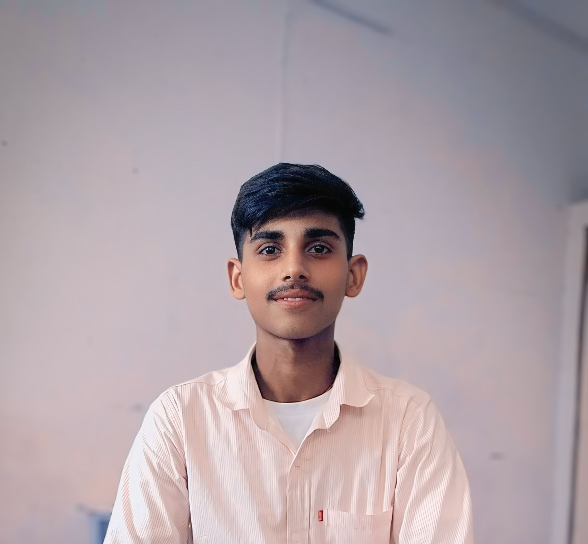
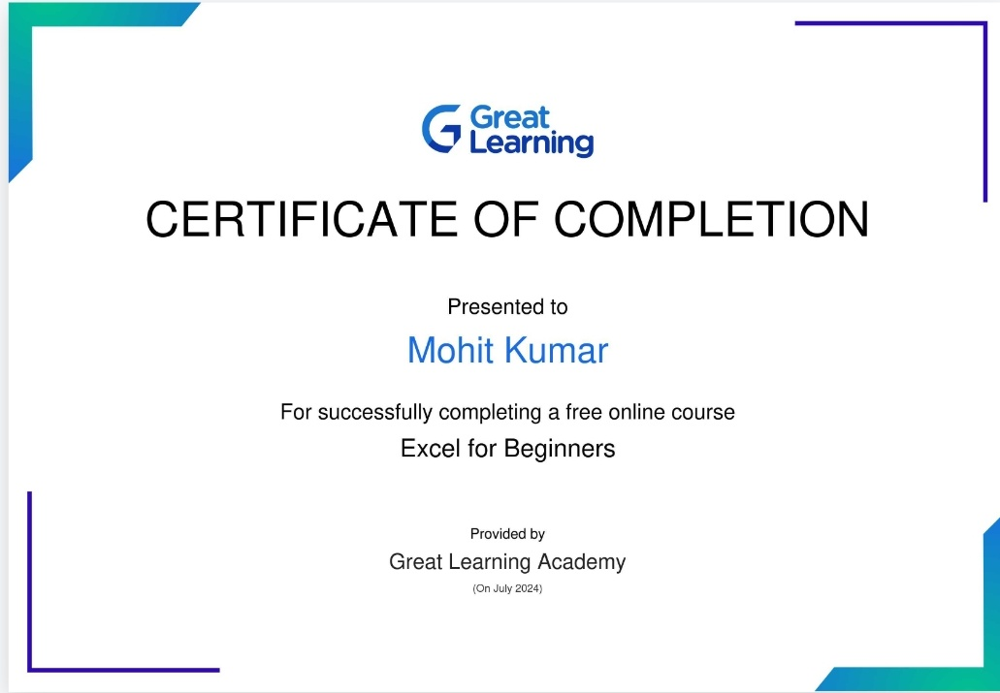

# Mohit-coder94.github.io

## Introduction

My name is Mohit kumar,and i am from Abohar.I really like programming and coding so therefore i take admission in branch computer science and engineering in the wonderful college Guru Nanak Dev Engineering College.I like to explore things.I want to develop a strong skill in coding.

## Education
### Class :- 12th
#### From :- Meritorious School, Bathinda

##### Marks details :-
| Subject | Obtained Marks | Total marks |
| ------ | ------- | ------- |
| Maths | 100 | 100 |
| Chemistry | 100 | 100 |
| Physics | 98 | 100 |
| Punajbi | 96 | 100 |
| English | 97 | 100 |

## My MS Excel certificate

# Induction Activity Report

### Day 1 :-
#### Date :- 10-07-2024

My college journey began with listening to kirtan at the campus Gurdwara Sahib. It felt really good to receive blessings before starting something new. After that, we sat in the auditorium and listened to speeches from the guests on the first day. 
### Guests of Day 1 
#### 1. Pr. Dr. Sehijpal Singh
- Pr. Dr. Sehijpal Singh Welcomed us to the GNDEC campus and introduce us about the campus facilites and benefits.The cheif guest was greeted with warmth and enthusiasm as they took the stage. Their presence added a sepcial touch to the begining of our college jouney,making the day evern more memeorable.
  
#### 2. NSET Dir. S. Inderpal Singh
- The director of Nankana Sahib Education Trust emphasized that Guru Nanak Dev Engineering College was founded to honor Nankana Sahib,the birthplace of Guru Nanak Dev Ji.The college started as a Polytechnic in 1953 and was officially established in 1956 with a mission to use technology to uplift economically disadvantaged areas.They pledged to enroll 70% of students from rural backgrounds. Over the last 50 years, the college has graduated nearly 10,000 undergraduates and 3,000 postgraduates,contributing significantly to society.

#### 3. Er. Jiwandeep Singh
- Er. Jiwandeep Singh, a dedicated PCS officer, imparted valuable advice: he encouraged us not to wait passively for opportunities but to actively seize them when they arise.
 He emphasized the importance of never letting opportunities slip away, urging us to seek them out earnestly and make the most of them.Furthermore, he suggested engaging with in-depth content to enhance our understanding and discovering our passions early in our journeys. 
His words resonated with respect and wisdom, guiding us towards a proactive and purposeful approach in our endeavors

#### 4. SSP Rajeshwer Singh
- SSP Rajeshwar Singh inspired us to always choose the path of kindness and helping others. Every good thing we do, and every bad thing too, always matters. He encouraged us to embrace four essential phrases:
1. I am Sorry
2. Please forgive me
3. Thank you
4. I love you

After every mistake and lie, we should immediately seek forgiveness from God. We can deceive others, but we can't deceive ourselves or God. Deep down, we always know the truth behind our lies.Just like Newton's third law states that every action has an equal and opposite reaction, whatever we give to the world and nature will eventually come back to us.

### Day 2 :-
#### Date :- 11-07-2024
### Guests of Day 2 
#### 1. Dr. Arvind Dhingra
- Today, we learned about the various societies and clubs on our college campus. They introduced us to SCIE, TSTE, E2S2 events, SAE, ISHRAI, ASME, ACM, PFA, CSI, the Data Science Club, Parwaaz Club, Live Wire Club, Causmic Club, English Club, ITian Club, and many more. Each group shared their goals and the benefits of joining them. Dr. Arvind Dhingra invited 22 students to the stage for a team strategy game, giving us a chance to introduce ourselves and experience personal and professional growth. Dr. Arvind Dhingra tells us about the type of memberships:-
1. Member
2. Active Member
3. Executive Member
4. Office Bearer

#### 2. Dr. Parminder Singh 
- He showed us the college’s excellent facilities, including well-equipped hostels, a modern computer center, a Computer Mathematics Laboratory (CML), and a comprehensive library. There are also sports facilities for physical activity and workshops for practical learning. Students can participate in leadership and service through NCC and NSS, and the Cultural Committee enhances campus life with various events.
#### 3. Dr. H.S. Rai
- Dr. H.S. Rai, the Controller of Examinations, shared his view that exams are opportunities to shine. He also talked about his journey to the Google Summer of Code with his students. He then invited coding enthusiasts to join the CodeGNE group and encouraged us to create a GitHub page using markdown and start blogging.

- 3Ps for Success:-
1. Passion
2. Persistence
3. Patience

### Day 3 :-
#### Date :- 12-07-2024
On the third day of induction program, I attend the classes of maths and peer interaction. This is my first day of classes in this College.I enjoy this day.
#### :- Peer interaction canva class
- In the class of peer interaction of canva our seniors of 2nd year teach us about various functions and features of canva and we are doing with them the practical. We made our projects. The canva class is very interesting.
 

