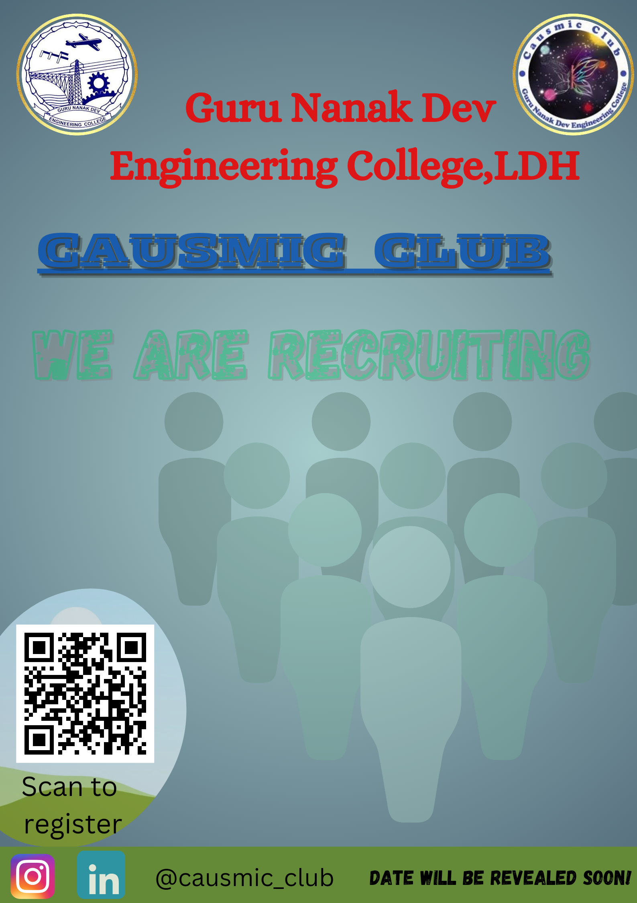

# Mohit-coder94.github.io

## Introduction

I am Mohit kumar,and i am from Abohar.I really like programming and coding so therefore i take admission in branch computer science and engineering in the wonderful college Guru Nanak Dev Engineering College.I like to explore things.I want to develop a strong skill in coding.

## Education
### Class :- 12th
#### From :- Meritorious School, Bathinda

##### Marks details :-
| Subject | Obtained Marks | Total marks |
| ------ | ------- | ------- |
| Maths | 100 | 100 |
| Chemistry | 100 | 100 |
| Physics | 98 | 100 |
| Punajbi | 96 | 100 |
| English | 97 | 100 |

## My MS Excel certificate

# Induction Activity Report

### Day 1 :-
#### Date :- 10-07-2024

My college journey began with listening to kirtan at the campus Gurdwara Sahib. It felt really good to receive blessings before starting something new. After that, we sat in the auditorium and listened to speeches from the guests on the first day. 
### Guests of Day 1 
#### 1. Pr. Dr. Sehijpal Singh
- Pr. Dr. Sehijpal Singh Welcomed us to the GNDEC campus and introduce us about the campus facilites and benefits.The cheif guest was greeted with warmth and enthusiasm as they took the stage. Their presence added a sepcial touch to the begining of our college jouney,making the day evern more memeorable.
  
#### 2. NSET Dir. S. Inderpal Singh
- The director of Nankana Sahib Education Trust emphasized that Guru Nanak Dev Engineering College was founded to honor Nankana Sahib,the birthplace of Guru Nanak Dev Ji.The college started as a Polytechnic in 1953 and was officially established in 1956 with a mission to use technology to uplift economically disadvantaged areas.They pledged to enroll 70% of students from rural backgrounds. Over the last 50 years, the college has graduated nearly 10,000 undergraduates and 3,000 postgraduates,contributing significantly to society.

#### 3. Er. Jiwandeep Singh
- Er. Jiwandeep Singh, a dedicated PCS officer, imparted valuable advice: he encouraged us not to wait passively for opportunities but to actively seize them when they arise.
 He emphasized the importance of never letting opportunities slip away, urging us to seek them out earnestly and make the most of them.Furthermore, he suggested engaging with in-depth content to enhance our understanding and discovering our passions early in our journeys. 
His words resonated with respect and wisdom, guiding us towards a proactive and purposeful approach in our endeavors

#### 4. SSP Rajeshwer Singh
- SSP Rajeshwar Singh inspired us to always choose the path of kindness and helping others. Every good thing we do, and every bad thing too, always matters. He encouraged us to embrace four essential phrases:
1. I am Sorry
2. Please forgive me
3. Thank you
4. I love you

After every mistake and lie, we should immediately seek forgiveness from God. We can deceive others, but we can't deceive ourselves or God. Deep down, we always know the truth behind our lies.Just like Newton's third law states that every action has an equal and opposite reaction, whatever we give to the world and nature will eventually come back to us.

### Day 2 :-
#### Date :- 11-07-2024
### Guests of Day 2 
#### 1. Dr. Arvind Dhingra
- Today, we learned about the various societies and clubs on our college campus. They introduced us to SCIE, TSTE, E2S2 events, SAE, ISHRAI, ASME, ACM, PFA, CSI, the Data Science Club, Parwaaz Club, Live Wire Club, Causmic Club, English Club, ITian Club, and many more. Each group shared their goals and the benefits of joining them. Dr. Arvind Dhingra invited 22 students to the stage for a team strategy game, giving us a chance to introduce ourselves and experience personal and professional growth. Dr. Arvind Dhingra tells us about the type of memberships:-
1. Member
2. Active Member
3. Executive Member
4. Office Bearer

#### 2. Dr. Parminder Singh 
- He showed us the college’s excellent facilities, including well-equipped hostels, a modern computer center, a Computer Mathematics Laboratory (CML), and a comprehensive library. There are also sports facilities for physical activity and workshops for practical learning. Students can participate in leadership and service through NCC and NSS, and the Cultural Committee enhances campus life with various events.
#### 3. Dr. H.S. Rai
- Dr. H.S. Rai, the Controller of Examinations, shared his view that exams are opportunities to shine. He also talked about his journey to the Google Summer of Code with his students. He then invited coding enthusiasts to join the CodeGNE group and encouraged us to create a GitHub page using markdown and start blogging.

- 3Ps for Success:-
1. Passion
2. Persistence
3. Patience

### Day 3 :-
#### Date :- 12-07-2024
On the third day of induction program, I attend the classes of maths and peer interaction. This is my first day of classes in this College.I enjoy this day.
#### :- Peer interaction canva class
- In the class of peer interaction of canva our seniors of 2nd year teach us about various functions and features of canva and we are doing with them the practical. We made our projects. The canva class is very interesting.
 

#### :- Maths calss
- Assistant professor of Mathematics, Mr.Neeraj kumar sir take the classs of maths. He teach basic of derivatives and formulas . We solve many problems and learn jayfully.

### Day 4 :-
#### Date :- 15-07-2024
### Speakers of Day 2 
#### 1. Dr. Randhir Singh
- In this short session with Randhir Sir, he showed us how to create a GitHub page.
#### 2. Dr. Pyare Lal Garg
- A wise sage shares his wisdom through poetry, encouraging us to believe in our potential. He teaches that with determination, any dream can be achieved. Embrace your passions, stay positive, and see challenges as chances to grow. Everyone faces failure, but resilience brings success. Choose hope over despair and focus on self-improvement. Your path to greatness starts from within.
#### 3. Mr. Sony Goyal
- Mr. Sony Goyal, a fantastic educator, gave an inspiring session on effective planning and personal excellence in engineering education. He stressed the importance of putting your full effort into every task and encouraged us to view the “science stream” more broadly instead of calling it “non-medical.” He advised focusing on one task at a time for the best results and urged us to learn with both our minds and hearts. Mr. Goyal encouraged us to ask questions whenever we have doubts. His passionate and engaging approach left a strong impression, motivating students to pursue academic excellence and personal growth with renewed enthusiasm.

- Always Remember
1. Give your 100%
2. Do what you love, love what you do
3. Should have Efficiency and Compatibility
#### 4. Mr. Pancham  
- He taught us about non-verbal communication, body language, and behavior. His skill in reading facial expressions, gestures, and the nuances of effective communication was impressive. Mr. Pancham’s interactive style made the learning engaging and practical, helping us better understand non-verbal cues and improve our interpersonal skills. He also shared inspiring stories and lessons from his leadership experiences in various societies. Later, he introduced us to the SAE Club, which offers exciting and creative activities that left me truly amazed.
  
### Day 5 :-
#### Date :- 16-07-2024
#### :- English Activity class
- In the class of English Activity there is our english based quiz in the hall there is two team of two sections section C and section D .The quiz is very enjoyable.In the next lecture there are 6 teams of both the sections and quiz is related to general knowledge this is very enjoyful moment for us.

  ### Day 6 :-
  #### Date :- 17-07-2024
  #### :- Maths class
  - On the day 6 of induction program the first lecture is maths lecture and Mr.Sukhminder singh teach again the basic of derivatives and at the last he gave us home work of 15 sums.
 
    #### :- UHV class
    Mrs.Nisha Mam takes our first class of UHV and she reaches very gently. she covered one and half chapter in the class.
    
### Day 7 :- 
#### Date :- 18-07-2024
#### :- UHV class 
- The next day there is our 2nd class of UHV back to back and she covered almost 2 chapters in the class .She teaches about the society of a human and how to behave with others in the society.

#### :- Peer interaction about college 
- Our seniors take the class of peer interaction and he said all about the college website and semester exams also . How to maintain discipline in the college and wirh the teachers.

##### In Auditorium
#### Dr. Harwinder Singh
- Dr. Harwinder Singh, the ANO of NCC, introduced us to the valuable benefits of joining NCC. He outlined both the physical and mental advantages, explaining that NCC provides army training while also helping to shape our personality, build confidence and communication skills, enhance leadership qualities and teamwork, and, most importantly, teach discipline.
##### Benefits of opting NCC includes:
1. SAHARA Scholarship for NCC cadets
2. Expenses of uniforms and camps are beared by the government
3. Chance to get selected in armed forces
4. NDA
5. Besides being position in armed forces, NCC also provides us life skills that serves us whole life.

#### Er. Jasvir Singh Grewal
- He discussed "The Power of Service: NSS and Nation Building," highlighting how the National Service Scheme (NSS) enables students to contribute to community development and national progress. NSS volunteers work on education, health awareness, environmental conservation, disaster relief, and social justice. Participation in NSS not only helps others but also builds valuable life skills and leadership qualities. He encouraged students to join NSS, emphasizing its role in linking academic learning with real-world problem-solving and fostering a more inclusive and prosperous nation. He also invited those who truly want to serve humanity to get involved.
##### Work Done by NSS:-
1. Afforestation
2. AIDS awareness
3. Blood donation camps
4. cleaniness of our environment
5. Disaster Manangement etc.
##### Benefits of NSS:-
1. Personality Development.
2. It helps in acquiring leadership qualities and democratic attitude.
3. It developer a sense of involvement in the task of nation building.
4. It helps in developing positive attitude, self-confidence, courage & patience.

### Day 8 :-
#### Date :- 19-07-2024
##### In Auditorium
#### Er. Kanwardeep Kalra
- Er. Kanwardeep Grewal introduced us to ***"The Journey from Campus to Corporate and Building a Future Beyond the Classroom."*** She emphasized that soft skills are as important as technical skills; without them, our technical abilities are less effective. We also watched a role play by seniors that demonstrated how to behave during interviews and how to manage our confidence in front of an interviewer.
##### What are soft skills?
- Basic etiquatee
- Personality traits

#### Dr. Jaswinder Singh
- This session with Jaswinder Sir was both engaging and entertaining. He started by asking the meaning of ***"Sat Sri Akal."*** Although he isn’t a magician by profession, he performed magic tricks and explained the science behind them. He demonstrated the importance of balance by making a table and taught us how to count the bones in the human body. Dr. Jaswinder Singh, the in-charge of IAPT and a Shiksha Ratan awardee, is a remarkable personality. He explained that everything in the world is connected to mathematics and provided clear examples. He introduced us to the concepts of induction and conduction, which can seem tough and boring in class, but he made them easy and enjoyable. He also gave us a fun trick to remember the number of bones in the human body and their distribution.

  ### Department visit:-
#### Department of Computer Science and Engineering
##### Department Vision
To develop skilled professionals who can join industry and research organizations both nationally and internationally.
##### Department Mission
- Offering a solid theoretical and practical foundation in computer science, focusing on software development.
- Teaching skills needed for ongoing education and professional growth.
- Providing computer education to empower youth in rural communities.
- Fostering professional behavior, strong ethical values, innovative research skills, and leadership abilities.
#### Societies and clubs in the Computer Science Department

1. CSI- Computer society of India
2. Data Science Club

The professors also provided details about the campus placement and training cells, highlighting that the highest package can reach up to 51 lakhs. We also learned about the examination system in the Computer Science Department. After this informative session, we had the chance to visit the computer lab.

  ### Day 9 :-
#### Date :- 22-07-2024
##### In Auditorium
#### Er. Dr. SB Singh
- Sir asked us to write down about your self like your name your fathers name your mothers name your senior secondary school name and your dream for which you come in college and what will we do to complete our dreams and what we expect from college after four years these things will make us introduced by our truth because we cant tell lie to ourselves. They also teach us very helpful life lessons.
#### Dr. Pushpinder Singh
- This session with Sir is very informative and helpful. Sir shared some valuable life lessons with us. He explained that to succeed, we need to be consistent and innovative. If we have a strong desire to achieve something, we can reach our goals with focus and concentration. He used the example of a woodpecker, which concentrates on one spot of a tree until it makes a hole. Sir also emphasized the importance of believing in ourselves and having faith in God. He said that humility is essential for survival. For instance, a bamboo tree bends during floods and survives, while big trees that don't bend often fall. This shows that being flexible helps us get through tough times.

  ### Day 10 :- 
#### Date :- 23-07-2024
#### UHV classes 
 On our 10th day there is our 2 classes of UHV continuesly by different professiors and the revised and continue the chapters.

 
